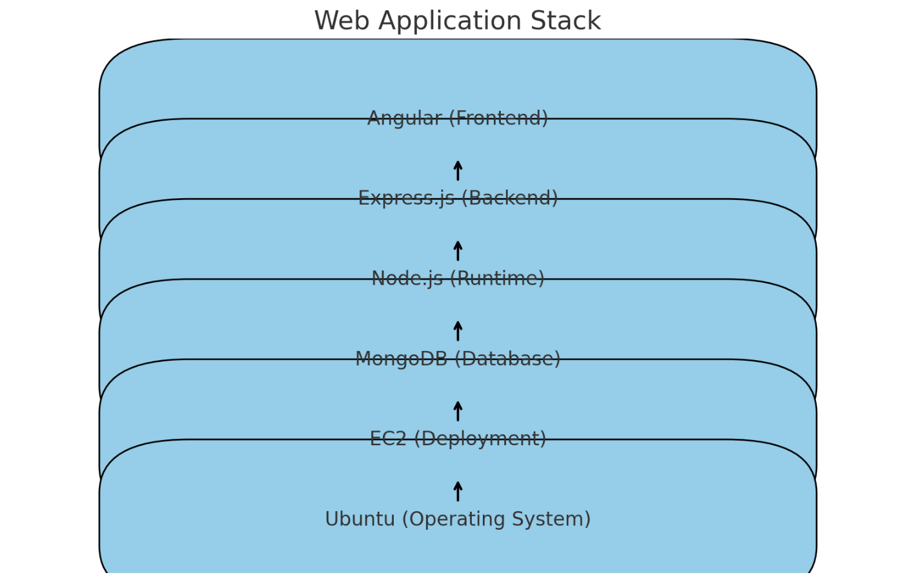

Here's a diagram representing the technology stack used in your web application:

1. Angular (Frontend): The front-end framework for building the user interface.
2. Express.js (Backend): The web application framework for handling server-side logic.
3. Node.js (Runtime): The JavaScript runtime environment for running the backend.
4. MongoDB (Database): The NoSQL database used for data storage.
5. EC2 (Deployment): The Amazon EC2 instance where the application is deployed.
6. Ubuntu (Operating System): The operating system running on the EC2 instance.

Backend routes:
- router.post("/", register);
- router.post("/login", login);
- router.post("/logout", logout);
- router.get("/:id", auth, getUserById);
- router.put("/:id", auth, updateUser);
- router.delete("/:id", auth, deleteUser);

Url
https://the-pokemon-stadium-battle.web.app/

Enjoy!!!
